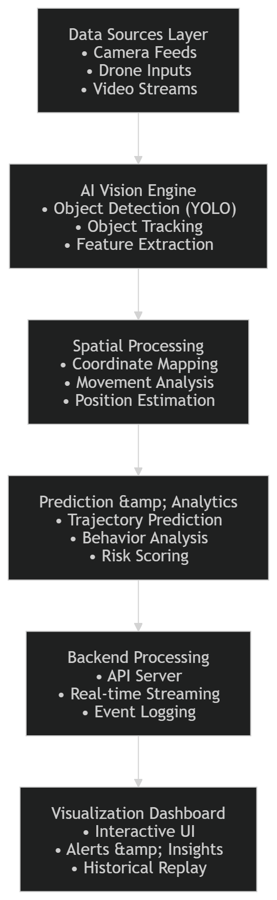

# AI Surveillance & Spatial Intelligence Platform

## 📌 Overview

This project is an AI-powered surveillance and spatial intelligence system designed to analyze visual data and generate meaningful insights in real time.

It integrates computer vision, object tracking, spatial analysis, and predictive modeling to monitor dynamic environments. The system can detect objects, track their movement across frames, estimate their spatial position, and predict future trajectories.

Through this project we can demonstrate how AI can be applied to real-world monitoring applications such as smart cities, traffic systems, environmental monitoring, and large-scale infrastructure analysis.

## 🚀 Key Features
**🔍 Real-Time Object Detection** : Utilizes deep learning models to detect objects in image and video streams(VisDrone, DOTA, xView).

**🎯 Multi-Object Tracking** : Maintains identity of multiple objects across frames using tracking algorithms.

**🌍 Spatial Mapping** : Transforms image coordinates into spatial representations for analysis and visualization.

**📈 Predictive Analytics** : Forecasts future movement of objects using machine learning techniques.

**⚠️ Adaptive Risk Scoring** : Assigns dynamic scores based on movement patterns and contextual behavior.

**🔗 Multi-Source Data Simulation** : Supports input simulation from multiple sources such as cameras, drones, or video feeds.

## 📊 Interactive Dashboard

Provides real-time monitoring, analytics, and historical playback.
An elite-grade Geospatial Intelligence (GEOINT) surveillance platform capable of detecting, tracking, geolocating, and predicting the movement of tactical assets across distributed sensor feeds.

## 🧠 System Architecture



## 🛠️ Tech Stack

- **Computer Vision**: Ultralytics YOLOv8, ByteTrack
- **ML Frameworks**: PyTorch, Scikit-learn
- **Geospatial**: Rasterio, PyProj, GeoPandas, Folium
- **Backend / Real-time**: FastAPI, WebSockets, Uvicorn
- **Dashboard**: Vanilla JS, Leaflet.js, CSS Grid
- **Deployment**: Docker, Docker-Compose, ONNX/TensorRT Export

## 🏗️ Phased Development Journey

1.  **Phase 1-2**: Environment setup & Dataset Engineering (VisDrone, DOTA, xView).
2.  **Phase 3-4**: Training YOLOv8 & Multi-Object Tracking (ByteTrack).
3.  **Phase 5-6**: Geospatial Mapping & Real-time Interactive Dashboard.
4.  **Phase 7-8**: Predictive Intelligence (Kalman/LSTM) & Behavioral Threat Scoring.
5.  **Phase 9-10**: Distributed Multi-Node Ingestion & Mission Replay System.

## 🚦 How to Run

1.  **Start Central Server**:
    ```bash
    python api/app.py
    ```
2.  **Launch Sensor Simulation**:
    ```bash
    python tests/simulate_distributed.py
    ```
3.  **Access Dashboard**:
    Open `dashboard/index.html` in your browser.

## 📡 Example Intelligence Event

```json
{
  "node": "SAT_GAMMA",
  "target_id": 4,
  "class": "aircraft",
  "latitude": 36.1630,
  "longitude": -115.1387,
  "threat_score": 0.67,
  "prediction_30s": [36.1634, -115.1380]
}
```
## 🔮 Future Enhancements

- Integration with real-time camera feeds

- Edge deployment for low-latency processing

- Advanced trajectory prediction using deep learning

- Integration with smart city infrastructure

- Automated anomaly detection

Cloud-based scalable deployment

## 📌 Conclusion

This project demonstrates how multiple AI techniques can be integrated into a unified system for intelligent monitoring and analysis. It highlights the potential of combining computer vision, spatial intelligence, and predictive analytics to build scalable real-world solutions.
---
